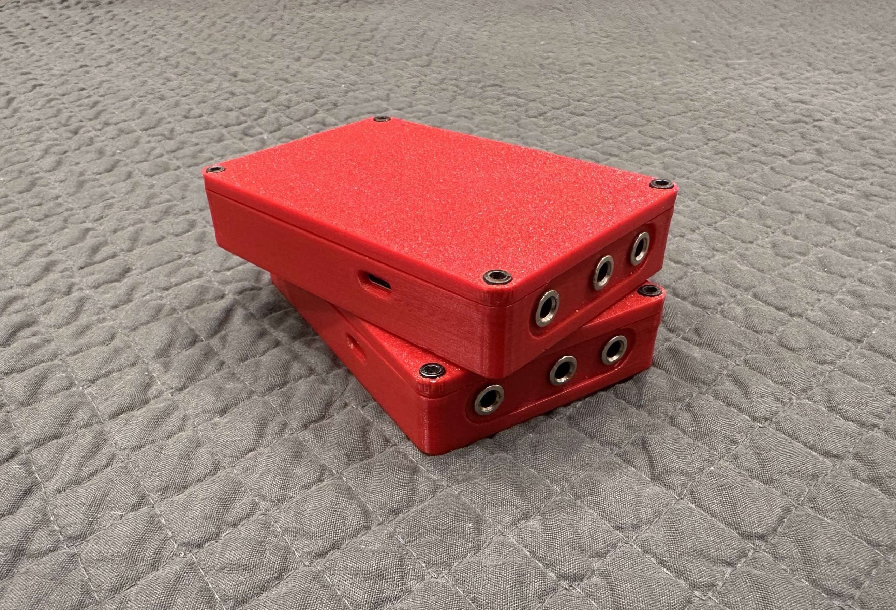
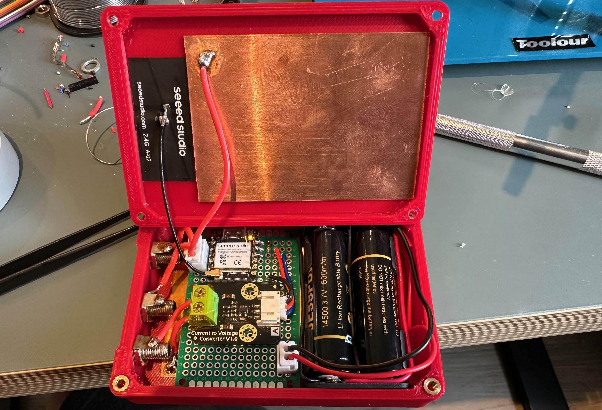
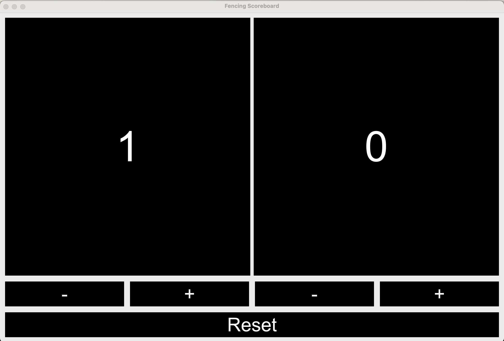
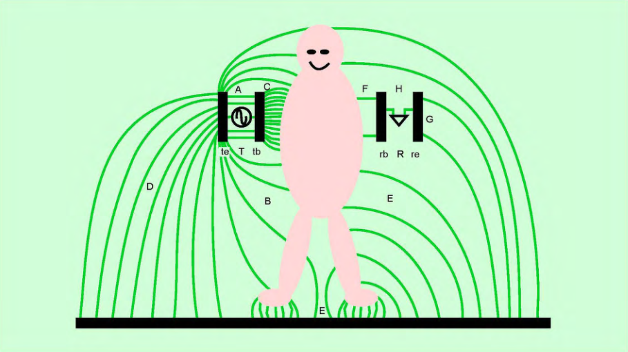
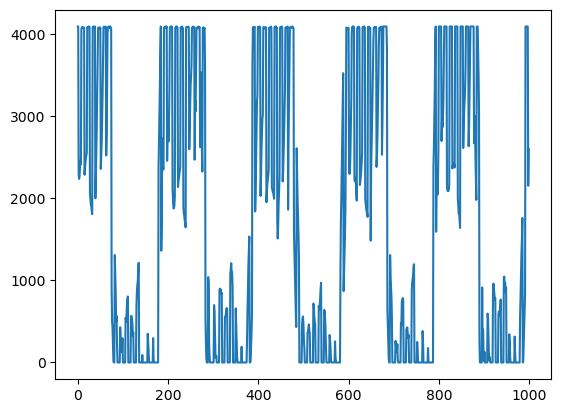
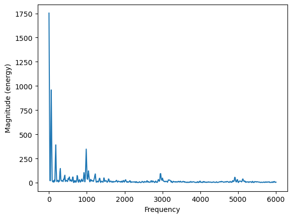

## A wireless alternative to reels in épée fencing

Traditional fencing reels have a few inherent disadvantages; namely they limit the fencer's mobility to an extent as well as being rather immobile themselves. They are also expensive. This is what motivated this project, as I had nowhere suitable to fence except my driveway and no reels I could buy or borrow. The result is a portable, pocket-sized device that the body wire plugs directly into.

- No modification of equipment required
- Always on, rechargeable battery lasts on the order of months, USB-C port for easy charging
- Uses laptop or other device to act as scoring box, complete with beep, lights, score
- Truly portable: body wires are the only required cables, no Wi-Fi or other connection needed

## Overview

  |  
:-------------------------:|:-------------------------:

<!-- 

  
   

 -->

### Transceiver device
Each device features a 3D printed PLA enclosure with 4 threaded inserts to allow the lid to be secured via screws. The front has 3 banana sockets which the épée body wire plugs into, and on the side is a USB-C port for both charging and wired firmware updates. Internally there is a XIAO ESP32 microcontroller which is mounted on a perfboard, to which is also attached a current-sensing circuit. The XIAO was chosen for to its small form factor, built-in charging circuit, and most importantly for its low power draw in sleep mode. The device is powered by two rechargeable lithium-ion 3.7V batteries wired in parallel. At the bottom of the enclosure sits a large copper plate that is attached to the circuit, forming one half of a capacitor. Attached to the bottom surface of the lid is another copper plate as well as the external antenna of the microcontroller. 

There is no power switch as the device is always on; when not in use it enters deep-sleep, consuming very little current. It wakes upon detecting a large change in capacitance at the sockets, which can be triggered by plugging in an épée or by simply touching two of the sockets. During use it is in light-sleep most of the time which powers off wireless peripherals. Only upon detecting a touch does it fully wake up briefly in order to transmit a signal.

### Scoring box
The scoring box consists of another ESP32 microcontroller connected to a laptop running server.py. It receives signals from the transceivers upon hit detection and handles lockout timing as specified by the [FIE material rules](https://static.fie.org/uploads/26/131720-book%20m%20ang.pdf) (page 88). Upon a successful hit the corresponding side of the scoreboard lights up and a beep is played. 

### On-target hit detection
The épée has three wires, two of which run the length of the blade and connect to the tip. The tip acts as a button which closes the circuit between the two wires upon being pressed. To detect a hit, each of the wires is connected to a pin. One pin is pulled to ground while the other reads voltage, such that it will read 0V when the tip is depressed. The software implements debouncing and also measures how long the button is pressed for, since a minimum duration is required to be considered a hit as defined by the FIE. Upon detection of a successful hit the device sends a signal to the scoring box microcontroller using the [ESP-NOW](https://docs.espressif.com/projects/esp-idf/en/stable/esp32/api-reference/network/esp_now.html) communication protocol, which is directly between devices and does not require a Wi-Fi connection.

### Off-target hit detection
The only non-valid targets in épée are the piste (metal strip on the ground fencers must stay on) and the bell guard (metal bowl on the hilt protecting the hand). In a normal wired setup these are connected to ground such that when the tip (which itself is conductive) touches these surfaces, it short-circuits and no touch is registered. Correctly detecting these non-valid touches is the primary difficulty for a wireless system. The issue is that now there are two separate devices and therefore no common ground. There are of course in general many ways we could detect two devices coming into contact, but we are restricted by the existing fencing equipment. One feature of the épée we could use is its third wire, which is connected to the conductive bell guard and would normally be connected to ground. The principle we will use is capacitive coupling. The idea is there exists some capacitance between everything; crucially in this case between your body and the ground, and the device to the body. A/C current can flow through capacitors [(displacement current)](https://en.wikipedia.org/wiki/Displacement_current_density#Current_in_capacitors) thus allowing us to create a closed circuit, with the shared ground being the actual ground/environment.

T. G. Zimmerman, "[Personal Area Networks: Near-field intrabody communication](https://sci-hub.box/storage/2024/1830/eb28829bee0100b64b673a7b91ebd16c/zimmerman1996.pdf)," in IBM Systems Journal, vol. 35, no. 3.4, pp. 609-617, 1996, doi: 10.1147/sj.353.0609.

This is the reason for the copper plates in the transceiver device. By applying a PWM voltage to a plate, or to the bell guard, we can detect the signal by measuring the displacement current on the other device. However, due to the very low capacitances involved, the total received current is very small (nano or even picoamp range). This makes consistently detecting it a challenge as it can be easily drowned out by noise. In addition, the dynamic nature of the sport poses a challenge as the fencers themselves are part of the circuit. Changes in positioning and distance result in different capacitances and thus differing signal strengths. It is also sensitive to the environment, for example it can pick up the 60Hz mains electricity.

  |  
:-------------------------:|:-------------------------:

The above shows the raw ADC values as measured by the receiving device, as well as the spectrum analysis of the same measurement. The transmitted signal was at 1KHz which can be clearly seen as a spike in the spectrum, as well as its harmonics at odd-numbered multiples of 1KHz (due to square PWM wave). A 60Hz signal corresponding to mains can also be seen. 

## Project status

Currently everything besides off-target hit detection works very well and has been consistent across many real fencing bouts. Off-target detection works but is not consistent enough to be reliable; it detects roughly half of bell guard hits but this depends greatly on factors such as the surroundings, as mentioned earlier. I have identified that a big factor that reduces reliability is the use of conducting grips, especially when combined with a glove that is too thin. This allows current to short-circuit between the épée and the fencer, greatly reducing signal strength. Insulated grips have a much better hit detection rate, though most épées use a conducting grip. The device is currently using a current sensor which has been modified by removing a feedback resistor, effectively making it an op-amp running in open-loop mode. While this gives it enough sensitivity to detect our small currents, I believe it is also leading to the signal being lost in some cases; a strong signal such as the 60Hz mains signal could be driving the op-amp to saturation, with our small signal unable to swing it back the other way. It could also be saturation recovery time, with it unable to respond to the A/C signal. I have tried rudimentary low and high pass filters as well as large feedback resistors but without much progress. Some other avenues to explore include:

- physical shielding and rearrangement to reduce losses due to parasitic capacitance
- differential signal
- comparator
- software approaches (i.e filtering)
- higher frequencies
- different opamp